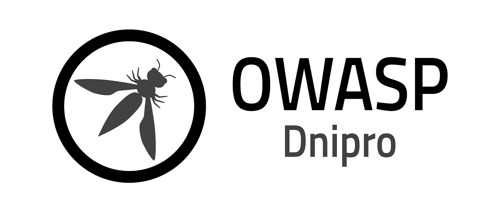

---

layout: col-sidebar
title: OWASP Dnipro
level: 0

region: Europe

---

## Who are we

OWASP Dnipro chapter was founded in 2018 by [Yan Lypnytsky](mailto:lypnytsky.yan@owasp.org).

## How to find us

Follow our news and announcements on social media:
[Facebook](https://www.facebook.com/owasp.dnipro)

Watch recordings of our previous events
[YouTube](https://www.youtube.com/channel/UC2XSB510iks7sGqTOT_n8mw)

## How to support the chapter

If your company wishes to support the chapter, please contact [Yan Lypnytsky](mailto:lypnytsky.yan@owasp.org).

# Future Events

## Become a Speaker

Call For Speakers at OWASP Dnipro events is permanently open. If you want
to present at future events, review and agree with the [OWASP Speaker
Agreement](Speaker_Agreement "wikilink") simply send the title and abstract
of your talk and speaker bio to [Yan Lypnytsky](mailto:lypnytsky.yan@owasp.org).

## Become a Sponsor

To sponsor an OWASP Dnipro event, contact [Yan Lypnytsky](mailto:lypnytsky.yan@owasp.org).

We don't have any special sponsorship package, however the sponsoring
organization or individual will receive our warm thanks and a fair
amount of gratitude spread over our social media presence, placed at the
chapter official web-page, and announced at the event itself.

## Become a Host

To host an OWASP Dnipro event, contact [Yan Lypnytsky](mailto:lypnytsky.yan@owasp.org).

Venue requirements include:

  - Capacity to welcome up to 100 attendees
  - Possibility to host a lunch (paid separately by the Chapter)
  - Separate high-quality internet connection for online streaming
  - No need for additional attendee registration or providing attendee lists
  - No marketing, advertising, or hiring at the event

## Announcements
>